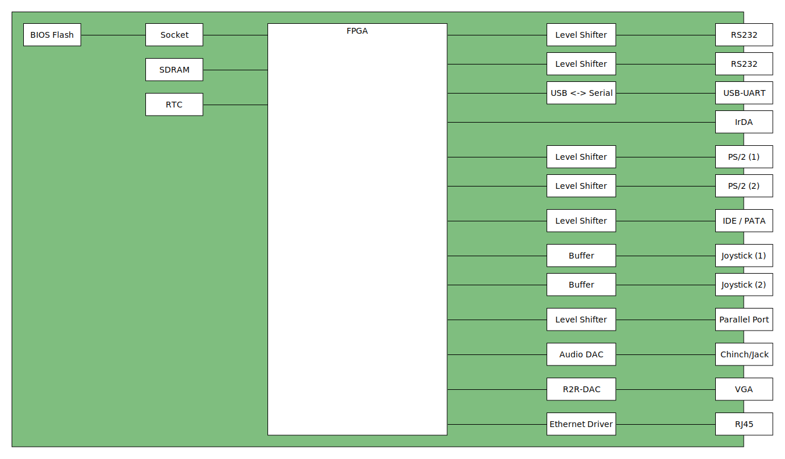
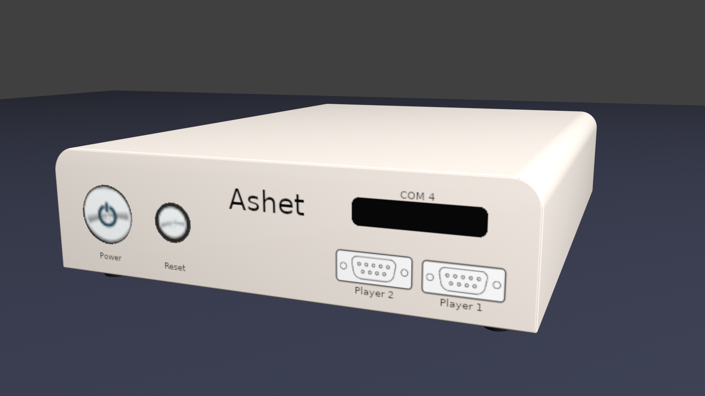
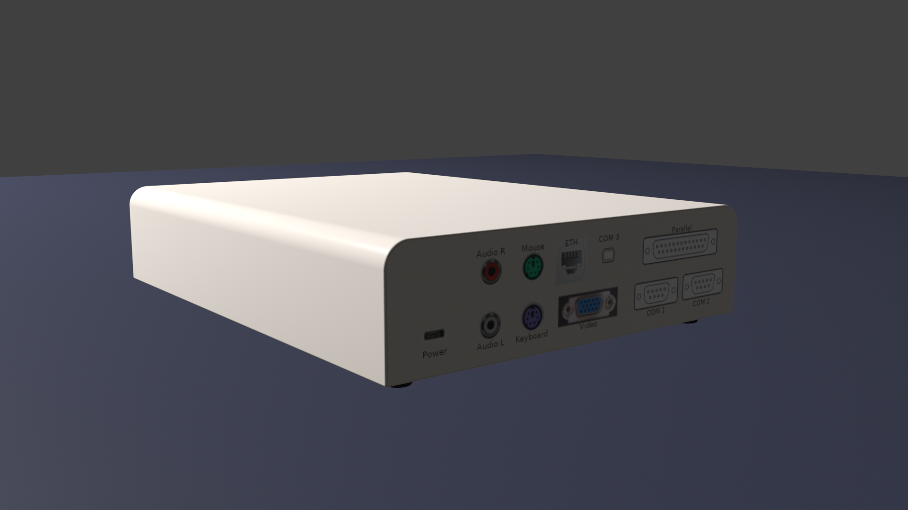

# 🐈 Ashet Home Computer 🐈

The Ashet Home Computer is a platform to build your own computers on.

## Features

- Huge ECP5 FPGA
- 16 MB flash (in a socket for easy exchange)
- 16 MB SDRAM (PC200)
- A VGA video port (RGB 565)
- Two fully featured RS232 serial ports
- An IrPHY compliant infrared port
- An USB-UART
- Two PS/2 compatible ports
- CompactFlash socket
- 2 D-Sub 9 Joystick ports compatible to C64, CPC, Amiga…
- IEEE 1284 II parallel port
- Studio-quality line audio from I²S
- Realtime clock
- 10/100 MBit Ethernet

## Block Diagram

## Concept Art

## Project Status

The project is in heavy planning phase with most of the required parts identified.

| Component     | Status           |
| ------------- | ---------------- |
| COM1          | Schematic        |
| COM2          | Schematic        |
| COM3          | Schematic        |
| COM4          | Schematic        |
| Joystick (1)  | Schematic        |
| Joystick (2)  | Schematic        |
| PS/2 (1)      | Schematic        |
| PS/2 (2)      | Schematic        |
| CompactFlash  | Schematic        |
| Parallel Port | Schematic        |
| PCM Audio     | Schematic        |
| VGA           | Schematic        |
| Ethernet      | Parts identified |
| RAM           | Parts identified |
| Flash         | Schematic        |
| RTC           | -                |
| FPGA          | -                |
| Power Supply  | -                |

## Contribution

The hardware is created with [KiCad](https://www.kicad.org/)
